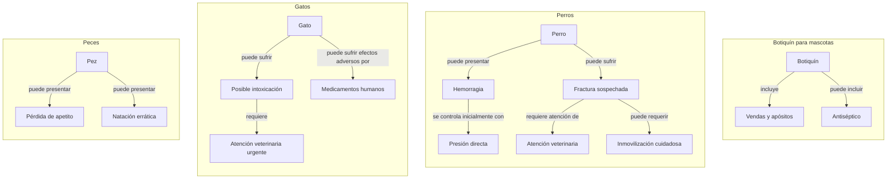

## Relaciones

```mermaid
flowchart TB

    subgraph BOT["Botiquín para mascotas"]
        direction TB
        B["Botiquín"]
        V["Vendas y apósitos"]
        A["Antiséptico"]
        B -->|incluye| V
        B -->|puede incluir| A
    end

    subgraph PER["Perros"]
        direction TB
        P["Perro"]
        H["Hemorragia"]
        F["Fractura sospechada"]
        PD["Presión directa"]
        IN["Inmovilización cuidadosa"]
        AV1["Atención veterinaria"]

        P -->|puede presentar| H
        P -->|puede sufrir| F
        H -->|se controla inicialmente con| PD
        F -->|requiere atención de| AV1
        F -->|puede requerir| IN
    end

    subgraph GAT["Gatos"]
        direction TB
        G["Gato"]
        I["Posible intoxicación"]
        MED["Medicamentos humanos"]
        AV2["Atención veterinaria urgente"]

        G -->|puede sufrir| I
        G -->|puede sufrir efectos adversos por| MED
        I -->|requiere| AV2
    end

    subgraph PEC["Peces"]
        direction TB
        PE["Pez"]
        AP["Pérdida de apetito"]
        NE["Natación errática"]

        PE -->|puede presentar| AP
        PE -->|puede presentar| NE
    end

    class P,G,PE animal
    class H,F,I,AP,NE problema
    class V,A,PD,IN recurso
    class AV1,AV2 atencion
```